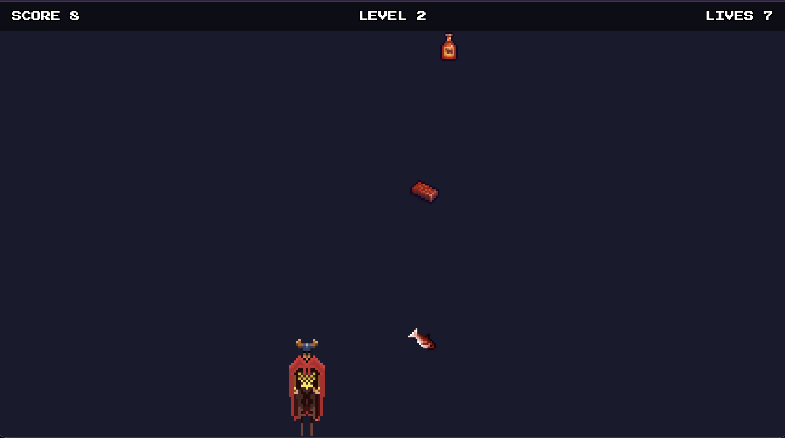

# Pixi Catcher

Catch the falling food before it hits the ground. A small arcade game in TypeScript and PixiJS 7.

[](https://github.com/mdev-co/pixi-catcher/actions/workflows/ci.yml)

**[Play it in the browser](https://mdev-co.github.io/pixi-catcher/)** — arrows or A and D to move, Space to start a new game.

**Reviewing this?** The [closed pull requests](https://github.com/mdev-co/pixi-catcher/pulls?q=is%3Apr+is%3Aclosed) carry the reasoning: what changed, why, and how it was tested, with a diagram for each non-trivial step. Short decision records live in [`docs/adr`](docs/adr).



## Requirements

- Node.js 16.16.0 and npm 8.11.0 (see `.nvmrc`; with nvm run `nvm use`)
- A modern browser with WebGL

## Quick start

```bash
npm install
npm start
```

The dev server prints a local URL; open it in the browser.

## Scripts

| Command                | What it does                                         |
| ---------------------- | ---------------------------------------------------- |
| `npm start`            | dev server with hot reload                           |
| `npm run build`        | type-check and production build into `dist/`         |
| `npm run preview`      | serve the production build locally                   |
| `npm test`             | unit tests (Vitest)                                  |
| `npm run check`        | type-check, ESLint and Prettier, the same gate as CI |
| `npm run lint:fix`     | fix lint issues automatically                        |
| `npm run format:write` | format all files                                     |

A husky pre-commit hook runs `npm run check`; CI runs check, tests and build on Node 16.16.0 and Node 20.

## How it is put together

```
src/
  main.ts            boots PixiJS, loads the atlases and the font, builds every object, runs the loop
  config/game.ts     every number worth tuning: player, items, levels, rules, HUD
  assets/            loads the texture atlases and the font, throws with the missing frame's name
  world/World.ts     the play area: fixed height of 720 units, width from the window, mask and background
  entities/          Player and FallingItem: each owns a sprite and exposes its hitbox
  spawner/           ItemSpawner and a generic Pool: items are recycled, never destroyed
  game/              Game holds the rules, collision.ts and levels.ts are pure functions
  input/             KeyboardInput turns key codes into named actions
  ui/                the HUD drawn by PixiJS, and the loading and game over overlays in HTML
```

Nothing reaches for its own dependencies. Every object is handed what it needs through its
constructor, and `main.ts` is the only place that knows about all of them. `Game` exposes the
score, the lives, the level and the state for reading only; it never calls the views. The
bootstrap copies those values into the HUD and the game over overlay on every frame, so changing
how the game looks never touches the rules.

The loop measures time in seconds, not frames, so the game runs the same on a 60 Hz and a 144 Hz
screen. PixiJS caps a frame at 100 ms, so coming back from another tab does not teleport every
item to the bottom.

The world has a fixed height of 720 units and takes its width from the window, with a minimum,
so the same numbers describe the game on every screen and a narrow window is letterboxed instead
of squeezing the player against the food.

Collision is a pure function of two rectangles. Every sprite is a rectangular tile, so a
rectangle is the exact hitbox, not an approximation. Rectangles that only touch at an edge do
not collide.

Diagrams are in `docs/diagrams` (the `.d2` sources render with [d2](https://d2lang.com)): the
[asset pipeline](docs/diagrams/assets-pipeline.svg), the
[item lifecycle](docs/diagrams/item-lifecycle.svg), the [game loop](docs/diagrams/game-loop.svg),
the [HUD](docs/diagrams/hud.svg) and the [game over flow](docs/diagrams/game-over.svg).

## How to extend it

**A new difficulty level.** Add a row to `LEVELS` in `src/config/game.ts`: the score it starts
from, the falling speed, the seconds between items and the player speed. No code changes. The
level is computed from the score on every frame, so there is no second place that could drift.

**A different kind of falling item**, say one that costs points instead of giving them. Give
`FallingItem` a kind, and branch on it in `Game.resolveItems`, which is the one place that turns
a touch into a rule. The spawner and the pool stay as they are.

**A new way to control the player.** `Game` depends on the `GameInput` type, not on the keyboard:
a direction and a restart flag. Touch or a gamepad is a second class with those two members, and
one line in `main.ts`.

**A new collision shape**, for a round enemy, where a rectangle stops being exact. Return
the new shape from that entity's `hitbox`,
add a pure function for that pair of shapes next to `intersects`, and pick it in
`Game.resolveItems`. Nothing else changes, because collision is a function of two shapes rather
than a method on a sprite.

**An effect when an item is caught**, such as a burst of particles. Add a `Particle` class with a
position, a velocity and a remaining lifetime, and a class that owns a `Pool<Particle>` and
updates the live ones. `Game` already knows the moment of a catch, so it gets one more
collaborator through its constructor and one call in `resolveItems`. The pool is generic on
purpose: particles are the second user it was written for, and they allocate nothing per catch.

**A new screen**, such as a start screen or a pause. Add a value to `GameState` and a branch to
the switch in `Game.update`; the compiler then points at every place that has to handle it,
because the switch has no default.

**Errors during the loop.** Anything missing in the atlases throws while loading and the message
lands on the loading screen. There is no path that throws once the loop is running, so there is
no try/catch around it: an error there would repeat sixty times a second, and catching it would
hide the cause instead of stopping the game. If one became possible, the right move is to stop
the ticker and show the same overlay, not to swallow it.

## Tests

`npm test` runs twenty six cases over the parts that hold rules: the collision function, the
keyboard, and the game rules themselves. They run in plain Node with no browser emulator,
because those parts import either nothing from PixiJS or only its plain objects.

The drawing layer has no tests on purpose. There are no rules there, only values copied onto the
screen, so a test would mostly be checking PixiJS.

One of these tests earned its place immediately: it caught a bug where releasing one of two keys
bound to the same direction stopped the player while the other key was still held.

## Decisions

- **Node 16.16.0 / npm 8.11.0.** Required by the task. Declared in `.nvmrc` and `engines`, enforced in CI.
- **Own minimal setup (Vite 4, TypeScript, PixiJS 7)** instead of the suggested pixi-hotwire boilerplate, whose current dependencies target Node 18+ and print engine warnings on Node 16. Three dev dependencies and a five-line Vite config.
- **PixiJS 7.4.3, pinned.** Same major as the boilerplates suggested in the task. Exact versions so `npm install` gives everyone the same tree.
- **TypeScript strict** plus `noUncheckedIndexedAccess`, `noImplicitReturns`, `noFallthroughCasesInSwitch`: array access returns `T | undefined`, every code path returns, no accidental switch fall-through.
- **A level is data, not code.** Difficulty lives in one table in `src/config/game.ts` and a five-line pure function picks the row for a score. Someone tuning the game changes numbers in one file and never opens a class.
- **Items are recycled, not recreated.** A generic pool hands out used items instead of allocating new ones, so the loop allocates nothing and the browser has no garbage to collect mid-game. Heap snapshots showed four item objects for an entire session.
- **Texture atlases generated before the commit** by `npm run assets:pack`, so eighty small files become two images plus two JSON descriptions. PixiJS reads that format natively and every sprite shares one texture, which means one draw call. See [ADR 0001](docs/adr/0001-pack-script-in-javascript.md).
- **Composition over inheritance.** `Player` owns a sprite instead of being one, so its public surface is three members rather than every method of a sprite. See [ADR 0002](docs/adr/0002-player-as-one-class.md).
- **ESLint 8, typescript-eslint 6 (type-aware), Prettier.** The last versions that support Node 16.16.0, hence the deprecation notices during install. Type-aware rules catch unhandled promises the compiler allows.
- **`npm audit` reports issues in dev tooling only.** They come from Vite, Vitest, esbuild and the ESLint plugins. Fixing them means moving to versions that require Node 18, which the task rules out. The browser gets one dependency: `pixi.js`.

## Credits

- Character sprites: [4 Directional Character](https://lionheart963.itch.io/4-directional-character) by Warren Clark (free to use, credit appreciated).
- Food sprites: [Free Pixel Food](https://henrysoftware.itch.io/pixel-food) by Henry Software (CC0).
- Font: [Press Start 2P](https://fonts.google.com/specimen/Press+Start+2P) by CodeMan38 (SIL Open Font License 1.1, see `public/fonts/OFL.txt`).

## License

© 2026 Data Technologies. Source published for recruitment review. All rights reserved.
